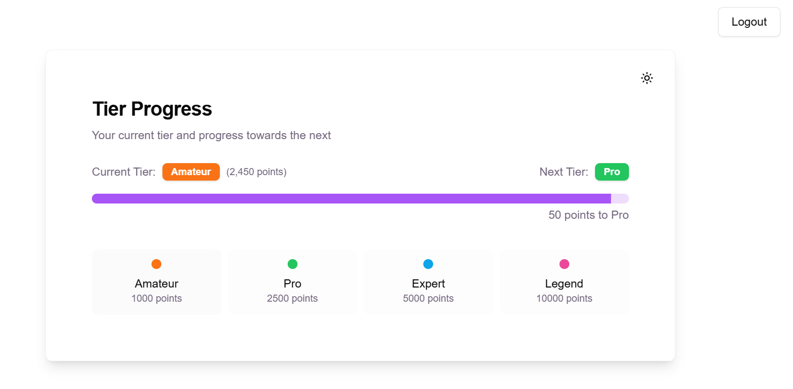
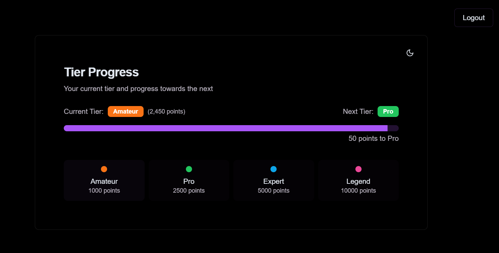

# On-Chain Tiers
A simple component that shows a users progression through different tiers based on the amount of on-chain points they have.



## Features
- 🎯 Configurable tier levels via tiers.json
- 📊 Visual progress tracking via [OpenFormat](https://www.openformat.tech/)'s API
- 🌓 Dark/Light mode support
- 🔐 Wallet authentication via [Privy](https://www.privy.io/)
- 🎨 Clean UI with [Shadcn](https://ui.shadcn.com/)
- ⚡️ Built with Next.js 14

## Getting Started

### Prerequisites
Before you begin, you'll need to set up accounts and configure the following:
1. **[Open Format Dashboard](https://app.openformat.tech/)**
- Create an account at [Open Format Dashboard](https://app.openformat.tech/)
- Create a new dApp to get your `OPENFORMAT_DAPP_ID`
- Generate an API key to get your `OPENFORMAT_API_KEY`
2. **[Privy Dashboard](https://dashboard.privy.io/)**
- Create an account at [Privy Dashboard](https://dashboard.privy.io/)
- Create a new app to get your `NEXT_PUBLIC_PRIVY_APP_ID` from the Settings section of your Privy app
- In the Login Methods section of your Privy app, enable:
    - Discord
    - Google
    - Email

### Deploy
Instantly deploy your own copy of the template using Vercel or Netlify, using the template tiers.json file:

[](https://vercel.com/new/clone?repository-url=https%3A%2F%2Fgithub.com%2Fdan-th3-man%2Fsimple-tiers-comp&env=OPENFORMAT_API_KEY,OPENFORMAT_DAPP_ID,NEXT_PUBLIC_PRIVY_APP_ID) [](https://app.netlify.com/start/deploy?repository=https://github.com/dan-th3-man/simple-tiers-comp)

### Local Development
1. Clone the repository:
```
git clone https://github.com/open-format/on-chain-tiers.git
cd on-chain-tiers
```

2. Install dependencies:
```
npm install
# or
yarn install
# or
pnpm install
```

3. Create a .env.local file in the root directory and add the following:
```
OPENFORMAT_API_KEY=your_openformat_api_key_here
OPENFORMAT_APP_ID=your_openformat_app_id_here
NEXT_PUBLIC_PRIVY_APP_ID=your_privy_app_id_here
```
4. Edit tiers.json as needed, this can be found in the `components/tier-progression.tsx` file. To do this you can use the tiers.json generator [here](https://tier-generator.v0.build/). It is used to configure the tiers and their respective points required to progress to the next tier, it uses this structure:
```
const tiers = [
  {
    name: "Amateur",
    pointsRequired: 1000,
    color: "bg-orange-500"
  },
  {
    name: "Pro",
    pointsRequired: 2500,
    color: "bg-green-500"
  },
  {
    name: "Expert",
    pointsRequired: 5000,
    color: "bg-sky-500"
  },
  {
    name: "Legend",
    pointsRequired: 10000,
    color: "bg-pink-500"
  }
]
``` 

5. Start the development server:
```
npm run dev
# or
yarn dev
# or
pnpm dev
```
6. Open http://localhost:3000 in your browser.

## Environment Variables

| Variable | Required | Example | Description |
|----------|----------|----------|-------------|
| NEXT_PUBLIC_PRIVY_APP_ID | Yes | cgg24234jq2373ryeh719gutpc | Your [Privy](https://www.privy.io/) application ID |
| OPENFORMAT_API_KEY | Yes | b315346c-d43b-4b37-aee9-621fgdg415b8e | Your [Open Format](https://app.openformat.tech/) API Key |
| OPENFORMAT_DAPP_ID | Yes | 0x0747d8a6e968422a4e506e820f51efaef757956c | Your [Open Format](https://app.openformat.tech/) dApp ID |

## Contributing 
Contributions are welcome! Please open an issue or submit a pull request.

